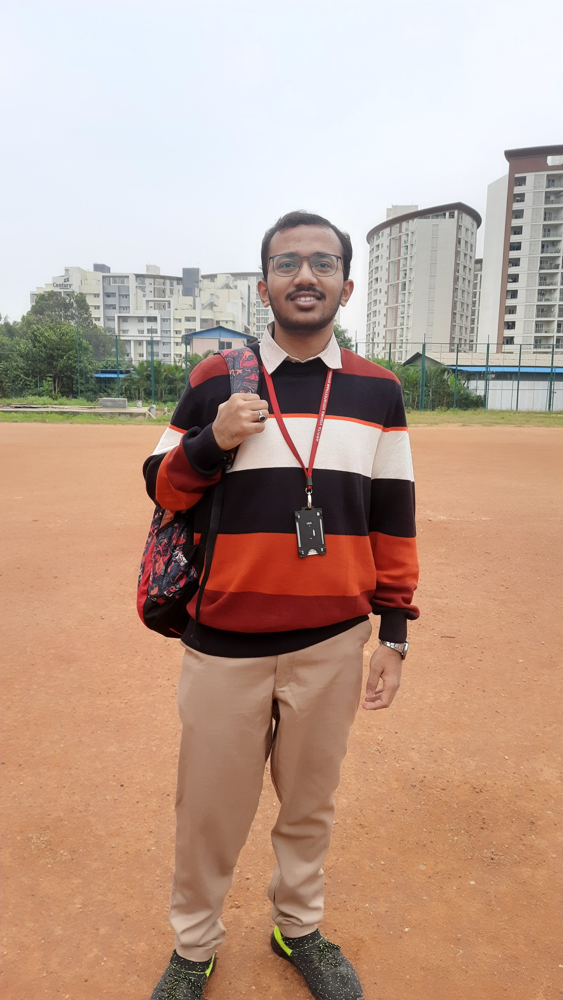

# Task 1: Capturing and Preparing the Person's Image

## Step 1: Capture a High-Quality Image

- Captured image of a person using a mobile camera  
  - **Size**: 2604 x 4624 pixels  
  - **Type**: JPEG image  
  - **File Size**: 1.9 MB  
  - **Folder**: Flam BlendPersonIntoScene Task  
  - **Aperture**: f/1.8  
  - **Exposure**: 1/104 sec  
  - **Focal Length**: 24.0 (35mm film), 5.2 (lens)  
  - **ISO**: 20  
  - **Metering**: Center-weighted average  
  - **Camera**: SM-M315F  
  - **Date**: Mon, 09 October 2023  
  - **Time**: 08:04:54 AM

- Captured a plain environment image using a mobile camera  
  - **Size**: 1836 x 3264 pixels  
  - **Type**: JPEG image  
  - **File Size**: 794.8 kB  
  - **Folder**: Flam BlendPersonIntoScene Task  
  - **Aperture**: f/2.2  
  - **Exposure**: 1/303 sec  
  - **Focal Length**: 13.0 (35mm film), 1.4 (lens)  
  - **ISO**: 40  
  - **Metering**: Spot  
  - **Camera**: SM-M315F  
  - **Date**: Thu, 11 August 2022  
  - **Time**: 06:14:46 PM

---

## Step 2: Remove the Background

- Removed the background using **Photopea** (free online Photoshop alternative)
- Used the **Magnetic Lasso Tool** to precisely select the person's boundary
- Inverted the selection and deleted the background

---

## Step 3: Blend the Image

- Copied the person’s image onto the background
- Scaled and positioned it to match the scene's perspective

- Observed edge differences in the merged image

- Adjusted foreground **brightness, contrast, and saturation** to harmonize with the background
- Opened the **"Blending Options"** for the person's image layer
- Tweaked the following settings to improve the blend

> ✅ The image blends well into the background after the manual adjustments.

---

